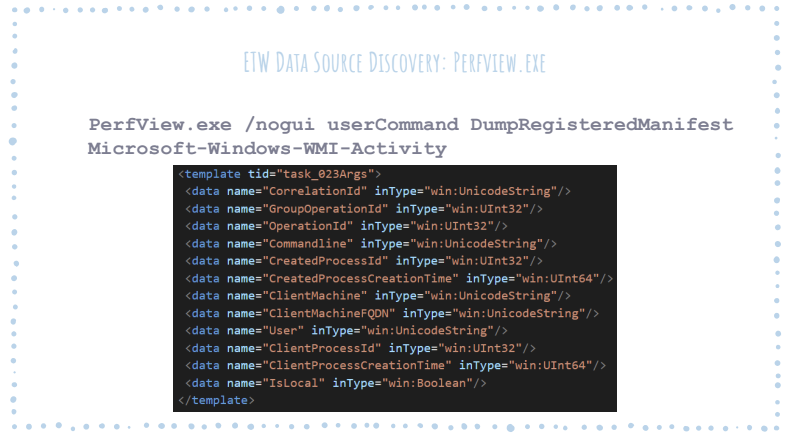

# TA_ETW

### Table of Contents
* [About](#about)
* [Libraries and Licensing](#libraries-and-licensing)
* [Usage](#usage)
  - [Installation](#installation)
    - [Requirements](#requirements)
    - [Precompiled releases](#precompiled-releases)
    - [Compiled from source](#compiled-from-source)
  - [Configuration](#configuration)
    - [Inputs.conf](#inputsconf)
    - [YAML Configuration Schema](#yaml-configuration-schema)
* [Crafting Configurations](#crafting-configurations)
* [Advanced YAML Configuration](#advanced-yaml-configuration)
  - [Timestamps and Literals](#timestamps-and-literals)
  - [Extraction](#extraction)
  - [Properties vs Fields](#properties-vs-fields)
  - [Filtering](#filtering)
  - [Enumerations](#enumerations)
  - [Transformations](#transformations)
  - [Translations](#translations)
* [Annotated Advanced YAML Configuration](#annotated-advanced-yaml-configuration)
* [Acknowledgements](#acknowledgements)

# About 

TA_ETW is a Splunk Technology Add-On (TA) for collecting [ETW](https://docs.microsoft.com/en-us/windows/win32/etw/event-tracing-portal) events from Windows systems. It allows the collection of events from one or more ETW providers on Windows systems with [Splunk's Universal Forwarder](https://docs.splunk.com/Documentation/Forwarder/latest/Forwarder/Abouttheuniversalforwarder) (UF).

TA_ETW is designed to provide flexibliity in its config schema. The following features are supported:
* Simultaneous execution of multiple user traces of ETW providers
  - Each trace is capable of collecting events from multiple event Ids
  - Each trace be configured to output its data to a specific Splunk index/sourcetype in:
    - The Index and Sourcetype options in the YAML config
    - The TA's inputs.conf
    - Both (in which case the YAML config is always preferred)
* Fields for outputted events may be:
  - Extracted from the trace event data
  - Extracted from the properties of the [krabsetw IEventRecord class](https://github.com/microsoft/krabsetw/blob/10661ab3794c87540294ea4e7b1b050fc773ff07/O365.Security.Native.ETW/IEventRecord.hpp#L20)
  - Generated timestamps
  - Literal values defined in the configuration file
* For each event Id, the following activities may be leveraged (see detailed documentation for more info):
  - Multiple trace event data extraction methods 
  - Multiple filtering options to eliminate undesired events from being delivered to Splunk
  - Conversion of enumeration constants to their friendlier string representation
  - Transformation methods to modify the event data prior to delivering it to Splunk
  - Translation for renaming the ETW event field's name to a more appropriate name for the use-case
  

# Libraries and Licensing
TA_ETW is licensed under [Apache License 2.0](LICENSE)

TA_ETW is built using Microsoft dotNet v4.5 and leverages the following third party libraries
  
| Library | License |
|---------|---------|
|[Splunk SDK for C#](https://github.com/splunk/splunk-sdk-csharp-pcl) | [Apache License 2.0](https://github.com/splunk/splunk-sdk-csharp-pcl/blob/master/LICENSE)|
|[krabsetw](https://github.com/microsoft/krabsetw) | [MIT License](https://github.com/microsoft/krabsetw/blob/master/LICENSE)|
|[Newtonsoft.Json](https://github.com/JamesNK/Newtonsoft.Json)|[MIT License](https://github.com/JamesNK/Newtonsoft.Json/blob/master/LICENSE.md)|
|[YamlDotNet](https://github.com/aaubry/YamlDotNet)|[MIT License](https://github.com/aaubry/YamlDotNet/blob/master/LICENSE.txt)

# Usage
## Installation

### Requirements

* 64-bit system
* [Visual C++ 2019 redistributable package](https://aka.ms/vs/16/release/vc_redist.x64.exe)
* At least v4.5 of the [.NET framework](https://www.microsoft.com/en-ie/download/details.aspx?id=30653)

### Precompiled releases
Head over to [releases](../../releases) to grab the latest version of the TA. The TA has been packaged into a SPL file using Splunk. SPL files are used for add-on installation in Splunk Enterprise. To deploy this TA via a deployment server to Splunk Universal Forwarders, copy the SPL file to the deployment-apps directory on the deployment server and extract it with the command `gzip -d -c TA_ETW.spl | tar -xvf -`. Then it can be deployed like any other app.

### Compiled from source
If preferred, TA_ETW can be compiled from source code instead.

When either a debug or release build is compiled from source, within the debug/release folder there will be a folder called app. This folder contains everything needed to package the TA as an app to Splunk.

## Configuration

### Inputs.conf

The inputs.conf for TA_ETW is quite simple, the only required elements are shown below

```
[TA_ETW://Friendly_Name]
yaml_config_path = Path_to_TA_ETW_YAML_config
```
The environment variable `$SPLUNK_HOME` is supported. It is highly recommended to leverage it for pointing to the YAML config, such as `$SPLUNK_HOME\etc\apps\TA_ETW\local\my_config.yaml`

Just like any other Splunk input, the index and sourcetype to use may be specified in the inputs.conf stanza. 

TA_ETW will follow these settings unless the YAML config trace specifies an index and/or sourcetype, in which case TA_ETW will always prefer the YAML config trace settings over the inputs.conf settings.

### YAML Configuration Schema

TA_ETW relies almost entirely on its YAML config to know what ETW providers to trace, what events to capture, what fields to collect from those events, how to filter/process the event fields, and where to send the output in Splunk.

## Crafting Configurations

Without blog posts and samples for the specific ETW provider, it can be very difficult to determine what the TA_ETW YAML configuration file should look like.

Matthew Graeber's talk from the final DerbyCon, [How do I detect technique X in Windows?](https://twitter.com/mattifestation/status/1170096146733309953), is a great resource explaining how to explore ETW providers to better understand what data is available.

Of particular interest should be the content starting at slide 20, where Matt goes into a discovery methodology for ETW data sources.

<sup>Slide 21 of Matthew Graeber's talk at DerbyCon 9.0, used with permission.</sup>


What Matt is showing in the slide above is how Microsoft's [PerfView](https://github.com/microsoft/perfview) can be used to obtain the manifest, or schema, of events published by an ETW provider. In this particular case, Matt is getting this information for the `Microsoft-Windows-WMI-Activity` ETW provider and the excerpt from the output of PerfView is showing Event Id 23's schema, which can be seen not only from the `task_023Args` in the template tag but also from the event definition further up in the file. 

Here's everything from the PerfView output that's relevant to Event Id 23.

###### Shortened ouput of `PerfView.exe /nogui userCommand DumpRegisteredManifest Microsoft-Windows-WMI-Activity`
```xml
<instrumentationManifest xmlns="http://schemas.microsoft.com/win/2004/08/events">
 <instrumentation xmlns:xs="http://www.w3.org/2001/XMLSchema" xmlns:xsi="http://www.w3.org/2001/XMLSchema-instance" xmlns:win="http://manifests.microsoft.com/win/2004/08/windows/events">
  <events>
   <provider name="Microsoft-Windows-WMI-Activity" guid="{1418ef04-b0b4-4623-bf7e-d74ab47bbdaa}" resourceFileName="Microsoft-Windows-WMI-Activity" messageFileName="Microsoft-Windows-WMI-Activity" symbol="MicrosoftWindowsWMIActivity" source="Xml" >
    <keywords>
    </keywords>
    <tasks>
     <task name="task_0" message="$(string.task_task_0)" value="0"/>
    </tasks>
    <events>
     <!-- removed other event definitions for brevity -->
     <event value="23" symbol="task_023" version="0" task="task_0" level="win:Informational" template="task_023Args"/>
      <!-- removed other event definitions for brevity -->
   </events>
    <templates>
      <!-- removed other template definitions for brevity -->
      <template tid="task_023Args">
        <data name="CorrelationId" inType="win:UnicodeString"/>
        <data name="GroupOperationId" inType="win:UInt32"/>
        <data name="OperationId" inType="win:UInt32"/>
        <data name="Commandline" inType="win:UnicodeString"/>
        <data name="CreatedProcessId" inType="win:UInt32"/>
        <data name="CreatedProcessCreationTime" inType="win:UInt64"/>
        <data name="ClientMachine" inType="win:UnicodeString"/>
        <data name="ClientMachineFQDN" inType="win:UnicodeString"/>
        <data name="User" inType="win:UnicodeString"/>
        <data name="ClientProcessId" inType="win:UInt32"/>
        <data name="ClientProcessCreationTime" inType="win:UInt64"/>
        <data name="IsLocal" inType="win:Boolean"/>
     </template>
     <!-- removed other template definitions for brevity -->
    </templates>
   </provider>
  </events>
 </instrumentation>
 <localization>
  <resources culture="en-US">
   <stringTable>
    <string id="task_task_0" value="task_0"/>
   </stringTable>
  </resources>
 </localization>
</instrumentationManifest>
```

To simply forward Event Id 23 from the Microsoft-Windows-WMI-Activity ETW provider with TA_ETW, the config YAML file would look like YAML section below. The XML above is used to determine the field names as well as how to extract data from them using the krabsetw library. In the section below, only the bare minimum to collect events from this provider will be shown. The current version of krabsetw used by TA_ETW specifically supports the following datatypes: 

* Binary
* AnsiString
* Int8
* Int16
* Int32
* Int64
* IPAddress
* UInt8
* UInt16
* UInt32
* UInt64
* UnicodeString

If a datatype not listed above is encountered, options for extraction are:
* [Submit an issue with krabsetw](https://github.com/microsoft/krabsetw/issues/new) asking them to support it and then [submit an issue with TA_ETW](../../issues/new) asking to have the new version of krabsetw leveraged once it is available.
* Trying a datatype extraction method that _should_ work. Ex: Using Int8 for a Boolean, which will happen in the sample below.
* Skipping the field in the event data because krabsetw and TA_ETW don't support getting that field's value ¯\\_(ツ)_/¯

###### Minimal config needed for Event Id 23
```yaml
Traces:
  - Name: TA_ETW_WMI
    Provider: Microsoft-Windows-WMI-Activity
    Events:
    - Id: 23
      Fields: 
      - Name: CorrelationId
        ExtractionMethod: GetUnicodeString
      - Name: GroupOperationId
        ExtractionMethod: GetUInt32
      - Name: OperationId
        ExtractionMethod: GetUInt32
      - Name: Commandline
        ExtractionMethod: GetUnicodeString
      - Name: CreatedProcessId
        ExtractionMethod: GetUInt32
      - Name: CreatedProcessCreationTime
        ExtractionMethod: GetUInt64
      - Name: ClientMachine
        ExtractionMethod: GetUnicodeString
      - Name: ClientMachineFQDN
        ExtractionMethod: GetUnicodeString
      - Name: User
        ExtractionMethod: GetUnicodeString
      - Name: ClientProcessId
        ExtractionMethod: GetUInt32
      - Name: ClientProcessCreationTime
        ExtractionMethod: GetUInt64
      - Name: IsLocal
        ExtractionMethod: GetInt8
```

Using the YAML config above with a Splunk inputs.conf that specifies an index will result in the events from this trace going into the specified index in Splunk with all of the event's fields.

## Advanced YAML Configuration
The minimal config will be effective in retrieving ETW data but what if filtering or other manipulation of the data is desired? TA_ETW has several advanced configuration options that can be used to facilitate this.

### Timestamps and Literals
TA_ETW can inject UTC timestamp and literal values into the events that it outputs. These can be used to include static information in the event data or to provide a timestamp field if the event that is being collected does not have its own.

###### Config showing timestamp and literal fields
```yaml
Traces:
  - Name: TA_ETW_DNS 
    Provider: Microsoft-Windows-DNSServer 
    Events: 
    - Id: 256 
      Fields:
      - Name: timestamp 
        IsTimestamp: true
      - Name: vendor_product
        IsLiteral: true
        LiteralValue: Microsoft DNS Server ETW
```

### Extraction
As mentioned in the simple example, TA_ETW needs to be told how to extract data from the fields of an ETW event.

The options available are:

* GetBinary
* GetAnsiString
* GetInt8
* GetInt16
* GetInt32
* GetInt64
* GetIPAddress
* GetUInt8
* GetUInt16
* GetUInt32
* GetUInt64
* GetUnicodeString

###### Config showing field value extraction
```yaml
Traces:
  - Name: TA_ETW_DNS 
    Provider: Microsoft-Windows-DNSServer 
    Events: 
    - Id: 256 
      Fields:
      - Name: QNAME 
        ExtractionMethod: GetAnsiString
```

### Properties vs Fields
TA_ETW by default interprets the name of a field in the YAML config as the name of a field within the captured ETW event. It will try to use that name with the extraction method provided to obtain the value for the field.

If a property of the ETW event class itself is needed, such as the event's EventId, the `IsField` option should be set to `false` to indicate to TA_ETW that it should look at the properties of the object rather than in its field data for the desired information.

When collecting a property of the ETW event, no extraction method is required but the datatype of the property must be JSON [serializable by JSON.Net](https://www.newtonsoft.com/json/help/html/SerializationGuide.htm).

###### Config showing collection of property data instead of field data
```yaml
Traces:
  - Name: TA_ETW_DNS 
    Provider: Microsoft-Windows-DNSServer 
    Events: 
    - Id: 256 
      Fields:
      - Name: Id
        IsField: false
        ExtractionMethod: GetInt32
```

### Filtering
It is possible to drop events from the ETW trace based on the value of a field in the event. Dropped events are discarded from the trace and will not be delivered to Splunk.

The options for filtering are:

* StartsWith
* Contains
* EndsWith

Note: while multiple filters may be configured by declaring multiple StartsWith, Contains, or EndsWith sections, each section should have only a single criterion.

###### Config showing filtering based on field value
```yaml
Traces:
  - Name: TA_ETW_DNS 
    Provider: Microsoft-Windows-DNSServer 
    Events: 
    - Id: 256 
      Fields:
      - Name: QNAME 
        ExtractionMethod: GetAnsiString
        Filters: 
          EndsWith:
          - microsoft.com.
          EndsWith:
          - google.com.
```

### Enumerations
Some ETW fields will return a numeric value that can be tied to an enumeration of string values. One such example is Microsoft-Windows-DNSServer's QTYPE field which maps to [DNS record types](https://en.wikipedia.org/wiki/List_of_DNS_record_types).

Note: If the a number appears in the event field that isn't defined in the FieldEnumeration section, the value of the field in the output will be `Enumeration for field {EventFieldName} not found with value {Number}`

###### Config showing enumeration lookup for a field
```yaml
Traces:
  - Name: TA_ETW_DNS 
    Provider: Microsoft-Windows-DNSServer 
    Events: 
    - Id: 256 
      Fields:
      - Name: QTYPE
        ExtractionMethod: GetInt32
        FieldEnumeration:
          0: Uknown # list shortened for brevity, always define all possible numbers from the field
          1: A
          5: CNAME
          15: MX
          16: TXT
```

### Transformations
If desired, the value of a event field can be modified before being output to Splunk.

The options for transformations are:

* Replace - replace a string with another string in the value of the field
  - Replace expects arguments `ReplaceOld` and `ReplaceNew` to be defined in the config
* RegexReplace - replace a string with another string in the value of the field using regular expressions
  - RegexReplace expects arguments `Regex` and `RegexReplacement` to be defined in the config
* TrimNChars - trim off the last N characters from the value of the field
  - TrimNCharts expects the argument `TrimNumber` to be defined in the config
* TrimChar - trim off the last character from the value of the field if it is this character
  - TrimChar expects the argument `TrimChar` to be defined in the config

Note: At this time only one transformation is supported for a field.

###### Config showing transformation of a field's value
```yaml
Traces:
  - Name: TA_ETW_DNS 
    Provider: Microsoft-Windows-DNSServer 
    Events: 
    - Id: 256 
      Fields:
      - Name: QNAME
        ExtractionMethod: GetAnsiString
        TransformationMethod:
          TransformationType: TrimChar
          TrimChar: .
```

### Translations
Field names can be changed from what they are called in the ETW event to any desired name. This change is reflected in the data that is sent to Splunk.

###### Config showing translation of field's name
```yaml
Traces:
  - Name: TA_ETW_DNS 
    Provider: Microsoft-Windows-DNSServer 
    Events: 
    - Id: 256 
      Fields:
      - Name: QNAME
        ExtractionMethod: GetAnsiString
        TranslationName: query
```


## Annotated Advanced YAML Configuration
See [sample_advanced_config.md](sample_advanced_config.md)
# Acknowledgements

* Thanks to [Zac Brown](https://twitter.com/zacbrown) and [others](https://github.com/microsoft/krabsetw/graphs/contributors) for their work on krabsetw, and a special thanks to Zac for fielding C# and ETW questions so patiently.
* Thanks to the developers of all of the [libraries](#libraries-and-licensing) that TA_ETW leverages.
* Thanks to [Matt Graeber](https://twitter.com/mattifestation) for his positive influence on the Infosec community, his fantastic research, and willingness to let his slides be used in TA_ETW's documentation.
* Thanks to everyone else not mentioned that helped make TA_ETW possible.
* Shout out to [@FuzzySec](https://twitter.com/fuzzysec) for creating [SilkETW](https://github.com/fireeye/SilkETW), which is a great tool for exploring ETW providers and collecting ETW data.
* Shout out to [@Cyb3rWard0g](https://twitter.com/Cyb3rWard0g) for his incredible [write-ups on combining SilkETW with HELK](https://medium.com/threat-hunters-forge/threat-hunting-with-etw-events-and-helk-part-1-installing-silketw-6eb74815e4a0).
